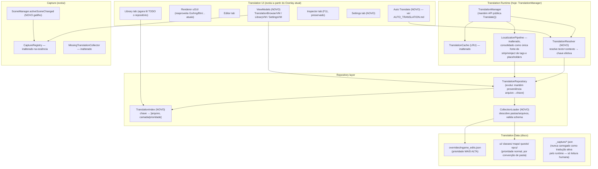

# ARCHITECTURE.md — Arquitetura futura proposta

> Este documento propõe evolução, não substituição. Tudo que já funciona bem
> hoje (pipeline de estágios, cache LRU, hot reload, formato `$meta` +
> `translations`, normalização de placeholders) é **preservado e reaproveitado**.
> As mudanças propostas atacam especificamente os itens listados em
> `TECHNICAL_DEBT.md`, nesta ordem de dependência: (1) correções pontuais
> sem risco → (2) identidade + storage em camadas → (3) GUI em camadas →
> (4) tradução automática → (5) atualização remota.

## Princípios que guiam as decisões abaixo

1. **Texto continua sendo a identidade primária.** Já é assim hoje e já
   funciona para a maioria dos casos — a normalização de `{player}/{n}/{map}/
   {npc}` que já existe é, na prática, uma forma de "colapsar variação
   irrelevante" que já resolve parte do problema de identidade. Não vamos
   trocar isso por caminho de `GameObject` (instável, muda toda atualização
   do jogo) nem por hash de conteúdo (não resolve o problema de contexto,
   só ofusca a chave). Ver `ADR-0001`.
2. **Organização em pastas é para humanos, não para o runtime.** Onde um
   arquivo mora (`Maps/Pirates/rhuibarb.json` vs. `Classes/Warrior.json`) é
   metadado de navegação — mover uma entrada de arquivo nunca deve mudar seu
   significado ou exigir remapeamento em runtime. Isso é o que torna "mover
   traduções entre arquivos" uma operação trivial
   em vez de uma migração de IDs.
3. **Aditivo, não destrutivo.** Todo entry hoje em `ingame_edits.json` ou em
   qualquer arquivo `$meta+translations` continua carregando sem alteração.
   Os novos campos de schema são opcionais.
4. **Sem HTTP síncrono no main thread. Sem execução de código baixado.**
   Não-negociável — ver `REMOTE_UPDATES.md`.

## 1. Visão em camadas



## 2. `TranslationResolver` — novo componente, resolve identidade + contexto

Hoje `LookupStage` chama `_repo.TryGet(texto)`. A proposta introduz um passo
antes dele (dentro do próprio `LookupStage`, sem novo estágio no pipeline —
menor mudança possível):

```
chave efetiva = f(textoNormalizado, contextoOpcional)

1. Se um contexto foi fornecido pelo chamador (ex.: "skill", "ui.button"):
   tenta "textoNormalizado@@contexto" primeiro.
2. Sempre tenta "textoNormalizado" (chave simples, comportamento atual).
3. Primeiro hit vence.
```

`TMPTextPatch` **pode**, opcionalmente, inferir um `contexto` grosseiro a
partir do tipo de UI conhecido (ex.: presença de `Selectable`/`Button` no
componente ⇒ `"ui.control"`; container nomeado de forma reconhecível ⇒
`"skill"`), mas **isso é só uma sugestão de contexto para quando o mesmo
texto colidir de fato** — não é obrigatório por entrada. Zero mudança para
o autor de uma tradução comum; o campo `context` só entra em cena quando
alguém, ao curar o conteúdo, percebe uma colisão real (ver §7).

## 3. Prioridade entre camadas

Ordem de carregamento e de resolução de conflito, da mais baixa para a mais
alta prioridade:

```
1. Conteúdo curado (ui/, classes/, maps/, quests/, npcs/) — mesma prioridade
   entre si; colisão entre eles indica que a chave precisa de `context`,
   não que uma pasta "vence" a outra.
2. overrides/ingame_edits.json — SEMPRE vence. É a superfície de correção
   rápida do tradutor em sessão; nunca deve ser silenciosamente sombreado.
```

Isso resolve diretamente `TECHNICAL_DEBT.md` #3. Ao carregar, o
`CollectionLoader` detecta quando duas chaves **idênticas** (mesmo texto e
mesmo `context`, se houver) aparecem em dois arquivos da **mesma camada**
com valores **diferentes** e loga um `WARNING` nomeando os dois arquivos —
nunca falha silenciosamente, nunca aborta o carregamento (uma tradução
quebrada não pode impedir o jogo de iniciar).

## 4. `TranslationIndex` — proveniência arquivo→chave

Resolve `TECHNICAL_DEBT.md` #11 e #13. Estrutura simples:

```csharp
sealed class TranslationIndex {
    // chave efetiva -> arquivo de origem (caminho relativo a translations/)
    IReadOnlyDictionary<string, string> SourceFile { get; }
    // arquivo -> todas as chaves que ele define (para a GUI navegar por arquivo)
    IReadOnlyDictionary<string, IReadOnlyList<string>> KeysByFile { get; }
}
```

Construído no mesmo passe que `TranslationRepository.LoadAll` já faz (não é
uma segunda varredura de disco). É isso que permite a "Biblioteca" (§Library
em `GUI_ARCHITECTURE.md`) navegar o corpus completo por pasta/arquivo, e é a
base de dados que a operação "mover tradução entre arquivos"
consulta e atualiza.

## 5. Consolidação de normalização (resolve `TECHNICAL_DEBT.md` #4)

Proposta: `TMPTextPatch` deixa de fazer strip de rich text e normalização de
placeholders por conta própria. Em vez disso:

- `RichTextStage` e `PlaceholderStage` (já existentes em `Pipeline/Stages/`)
  passam a ser os **únicos** donos dessa lógica.
- A lógica hoje em `TMPTextPatch` (`NormalizeUsernamePlaceholders`,
  `NormalizeNumbers`, `NormalizeMaps`, `NormalizeNpcNames` e seus
  `RestoreX`) migra, **sem reescrever o algoritmo** (ele já funciona e tem
  casos de borda calibrados — só muda de arquivo), para um novo
  `Pipeline/Stages/GameSpecificPlaceholderStage.cs`, inserido entre
  `PlaceholderStage` e `LookupStage`.
- `TMPTextPatch.DoTranslate` passa a fazer só: filtros de curto-circuito
  (`IsNumericOrDate`, `IsDynamicGameContent`, nameplate, InputField) +
  chamar `TranslationManager.Translate(original, ctx)` com o texto **bruto**
  (sem pré-normalizar). Isso elimina a duplicação sem descartar nenhuma
  regra já calibrada em produção.

Este passo deve vir acompanhado de uma checklist manual de regressão (lista
de ~15-20 strings reais do jogo cobrindo cada regra) antes de ser
considerado concluído — é um refactor de lógica sensível, não uma reescrita.

## 6. Interceptação de `UI.Text` — implementado, com revisão de escopo

Resposta fundamentada no que a Unity/BepInEx realmente permitem (não existe
um evento genérico "qualquer texto mudou" na engine — os únicos pontos de
interceptação confiáveis continuam sendo os setters/`SetText`/`OnEnable`,
iguais aos já usados para TMP):

1. **Patchear `UnityEngine.UI.Text.text`** com o mesmo padrão de Prefix já
   usado em `TMP_Text.text` (resolve `TECHNICAL_DEBT.md` #1) — **feito em
   2026-09-21**, `Interceptors/LegacyTextPatch.cs`. Isso torna a *correção*
   da tradução de UI.Text event-driven (no momento da escrita), eliminando
   o atraso de até ~1s que existia antes.

> **Revisão de decisão (2026-09-21)**: as propostas originais abaixo — (2)
> substituir o timer perpétuo de 1Hz por `SceneManager.activeSceneChanged`,
> e (3) remover o toggle "⟳ Auto" — foram **descartadas a pedido do
> usuário**. A varredura periódica (`ScanVisibleIntoRegistry`) é mantida de
> propósito: é o que atualiza a lista do overlay sem exigir clique manual
> em "Refresh", e o custo não é perceptível na prática de uso real medida
> pelo usuário. Com o patch do item 1 no lugar, essa varredura deixou de
> ser necessária para a *correção* da tradução (que agora é instantânea) —
> ela continua existindo só para a *descoberta*/exibição de texto novo na
> lista da GUI, que é exatamente o papel que o usuário quer que ela
> continue tendo. Texto original das propostas descartadas, mantido aqui
> como registro de decisão (ver também `ADR-0004`):
>
> 2. ~~Usar `SceneManager.activeSceneChanged` para disparar uma varredura
>    pontual por troca de cena, em vez de um timer perpétuo.~~
> 3. ~~Remover o "⟳ Auto" (comparação de todo o conjunto visível por
>    frame).~~ — também mantido; é opt-in, desligado por padrão, e o
>    usuário não pediu para removê-lo.

O que continua valendo: **não fingir que existe um sistema de eventos
genérico da Unity para "texto mudou"** — não existe. A resposta honesta ao
que a engine permite é patchear onde dá (setters/`SetText`/`OnEnable`) e
usar varredura periódica só onde isso realmente agrega (descoberta para a
GUI), não como substituto de interceptação real.

## 7. Quando (e só quando) usar `context`

Fluxo esperado na prática, não uma regra abstrata:

1. Tradutor está trabalhando e percebe que "Attack" (skill) precisa de uma
   tradução diferente de "Attack" (botão de ataque automático).
2. Na GUI, ao editar a entrada, usa a opção "Desambiguar por contexto" —
   isso transforma a entrada simples (`"Attack": "Atacar"`) na forma
   estendida com `context` (ver `TRANSLATION_FORMAT.md`), copiando a
   entrada existente e dando ao tradutor um campo para nomear o novo
   contexto (`skill`, `ui.button`, etc., texto livre mas com sugestões dos
   contextos já usados no corpus).
3. O runtime, ao encontrar as duas variantes, usa a "dica de contexto" que
   `TMPTextPatch`/`Resolver` conseguir inferir (tipo de componente,
   container conhecido) para escolher; se não conseguir inferir, cai para a
   entrada sem contexto (comportamento de hoje, nunca quebra).

Isso mantém 100% dos ~500+ (ou o que já existir) entradas atuais
funcionando sem tocar em nada, e só cresce em complexidade exatamente onde o
projeto realmente precisar.

## 8. O que muda para quem já usa o sistema hoje

| Hoje | Depois | Quebra algo? |
|---|---|---|
| `translations/*.json` com `$meta`+`translations` | Mesmo formato, campos novos opcionais | Não |
| `translations/ingame_edits.json` na raiz | Convém mover para `translations/overrides/ingame_edits.json` (ver `MIGRATION.md`), mas o loader aceita ambos os caminhos por um período de transição | Não, com plano de migração |
| Categoria = nome do arquivo | Continua funcionando; passa a existir também um índice por pasta | Não |
| Chave = texto puro | Continua sendo a chave por padrão; `context` é opt-in | Não |
| `"X":"X"` para ignorar | Novo campo `ignore:true`; leitura antiga continua sendo interpretada como ignorada | Não |

## 9. O que esta arquitetura deliberadamente NÃO faz agora

- Não introduz banco de dados/SQLite — arquivos JSON continuam sendo a
  fonte de verdade; é o formato mais fácil de revisar em PR e de editar à
  mão em emergência.
- Não implementa carregamento preguiçoso por mapa/classe ainda — ver
  `ROADMAP.md` e a nota de investigação sobre `StateManager`.
- Não implementa o instalador, o bot do Discord, nem a plataforma web —
  fora de escopo do projeto por enquanto.
