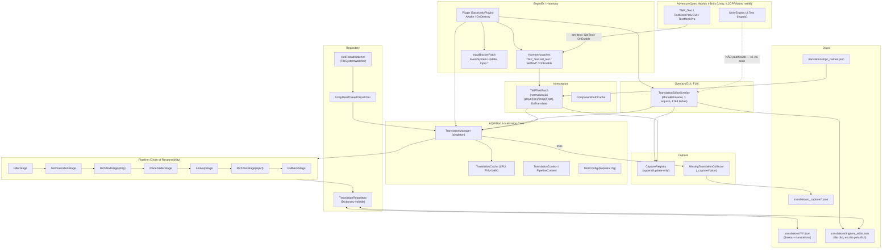
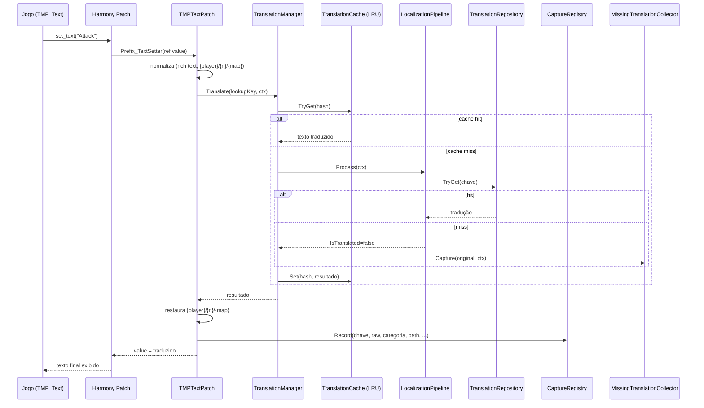
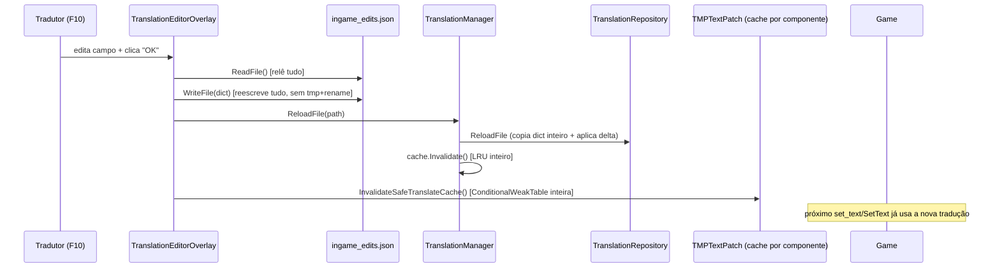

# CURRENT_SYSTEM.md — Arquitetura atual (as-is)

> Este documento descreve o sistema **exatamente como ele existe hoje** no código
> (lido linha a linha em `Plugin.cs`, `Core/`, `Repository/`, `Pipeline/`,
> `Interceptors/`, `Capture/`, `Overlay/`, `Utils/`, `Debug/`). O sistema já conta com um
> pipeline de estágios, repositório com hot reload, cache LRU e um formato de
> arquivo com metadados. Os pontos fracos atuais são que
> **a identidade da tradução é só o texto**, a captura roda em polling
> permanente, e a GUI é um monólito de 1764 linhas sem separação de camadas.

## 1. Visão geral dos componentes



## 2. Entry point e ciclo de vida (`Plugin.cs`)

`Plugin` é um `BaseUnityPlugin` do BepInEx (`GUID com.aqwmod.localization`,
`BepInProcess("AdventureQuest Worlds Infinity.exe")`, target `net48`).

**`Awake()`**, tudo dentro de um único `try/catch` que, se falhar, loga e deixa o
jogo continuar **sem tradução** (falha segura — bom):

1. `ModConfig.Initialize(Config)` — expõe todas as configurações via `.cfg` do BepInEx.
2. Se `Enabled=false`, retorna cedo.
3. `UnityMainThreadDispatcher.Initialize()` — cria um `GameObject` `DontDestroyOnLoad`
   que drena uma `ConcurrentQueue<Action>` no `Update()` (máx. 5 ações/frame).
4. `ResolveTranslationsPath()` — resolução em cascata entre 3 layouts possíveis
   de instalação (`plugins/translations`, `<dll>/translations`,
   `plugins/AQWTranslation/translations`); usa o primeiro que existir **e**
   contiver `.json`; senão cria o primeiro candidato vazio.
5. `TranslationManager.Instance.Initialize(path)` — ver §3.
6. `TMPTextPatch.LoadNpcNames(path)` — carrega `npc_names.json` (opcional, sem hot reload).
7. Registro de patches Harmony **individualmente**, cada um em seu próprio
   `try/catch` (`TryPatch`) — uma falha de patch não derruba os demais. Isso é
   uma decisão de robustez deliberada e documentada no código (a versão do
   Harmony/MonoMod embutida não consegue fazer bind de `ref string` em métodos
   abstratos, então `SetText(...)` usa Postfix, não Prefix — ver §4).
8. Cria o `GameObject _AQWTranslationEditorOverlay` (`DontDestroyOnLoad`) com o
   `TranslationEditorOverlay`. O prefixo `_AQW` é contratual: toda a lógica de
   varredura/inspector ignora qualquer objeto cujo `transform.root.name`
   comece com `_AQW`, para não se autocapturar.

**`OnDestroy()`**: `Harmony.UnpatchSelf()` + `TranslationManager.Shutdown()`
(para o watcher, faz flush do coletor de textos não traduzidos, opcionalmente
despeja estatísticas no log).

## 3. `TranslationManager` — orquestrador central

Singleton `Lazy<T>` thread-safe. Dono de: `TranslationRepository`,
`LocalizationPipeline`, `MissingTranslationCollector`, `TranslationCache`,
`HotReloadWatcher`, `TranslationLogger`, `TranslationStats`.

`Translate(original, context)` — **hotpath**, chamado só pelos patches Harmony:

1. Early-outs: mod desabilitado, string vazia/whitespace, `Length < 2`.
2. **Cache hit** (LRU por hash FNV-1a64 de 64 bits do texto) → retorna direto,
   sem alocar `TranslationContext`/`PipelineContext`. Este é o "caminho feliz".
3. Cache miss → roda o pipeline completo (§5), aplica `UnescapeLineBreaks`
   (converte `\n`/`\r\n`/`\r`/`\t` **literais** — 2 caracteres, barra+letra —
   em quebras/tabs reais, só no texto **traduzido**, nunca no original do
   jogo) e grava no cache.
4. Miss real → incrementa stats, opcionalmente loga, e — se `CaptureEnabled`
   — empurra para `MissingTranslationCollector`.

`HandleHotReload(filePath)`: recarrega só o arquivo alterado no
`TranslationRepository`, invalida o cache LRU inteiro, dispara
`OnTranslationsReloaded`.

## 4. Interceptação de texto (`Interceptors/TMPTextPatch.cs`, 889 linhas)

Existem **quatro pontos de interceptação diferentes para `TMP_Text`**, e
**nenhum para `UnityEngine.UI.Text`** (legado):

| Ponto | Tipo de patch | Por quê |
|---|---|---|
| `TMP_Text.text` (setter) | **Prefix**, `ref string value` | Não é abstrato — bind normal funciona. Cobre a maioria dos casos (qualquer código do jogo que faça `label.text = "..."`). |
| `SetText(string)` / `(string,bool)` / `(string,float,float,float)` | **Postfix** | `TMP_Text` é abstrata; o Harmony/MonoMod desta stack **não consegue** bindar `ref string __0` em método abstrato (causa raiz documentada no código). Postfix lê `instance.text` já setado, traduz, e reescreve — guardado por `[ThreadStatic] _isTranslating` para não entrar em loop (a reescrita dispara o Prefix acima). |
| `TextMeshProUGUI.OnEnable` / `TextMeshPro.OnEnable` | **Postfix** nas classes **concretas** | Textos serializados pelo Editor/prefab nunca passam pelo setter. Patchar `TMP_Text.OnEnable` (herdado de `MaskableGraphic`) afetaria **todo** `Graphic` do jogo (Image incluída) — por isso patcheiam as concretas. |
| `UnityEngine.UI.Text` | **Nenhum** | Não existe patch Harmony para UI.Text. É alcançado **só** pela varredura ativa (polling, §7) + reescrita manual ("enforcement-on-scan"). |

A lacuna em UI.Text é estrutural, não um bug pontual: balões de diálogo/popup
legados (`"Goto map ... quest \"...\""`) ficam em inglês até o próximo tick de
varredura (até ~1s de atraso) e só são reescritos se `EnforceOnScan=true`
(default). Ver `TECHNICAL_DEBT.md` #1.

### 4.1 `DoTranslate` — a lógica real de normalização (o coração do sistema)

Ordem exata de decisão para cada string interceptada:

1. `IsNumericOrDate` — heurística sem regex: filtra "42", "100/200", "12:30",
   "v2.0.1", "1.5k" (regra: 0 letras ⇒ filtra; ≤2 letras com ≥2× mais dígitos ⇒ filtra).
2. `IsDynamicGameContent` — filtra três padrões runtime-only:
   timestamp `NN/NN/NNNN`; ids de instância de mapa `"battleon-1001"`
   (minúsculas antes do hífen + dígitos depois); tokens sem espaço contendo `_`
   (usernames).
3. Nameplate de jogador: se `transform.parent.name == "Names"`, registra o
   nome em `KnownPlayerNames` (para reconhecer usernames **sem** `_`, como
   `"xow"`) e **nunca traduz**.
4. Pula `TMP_Text` dentro de `TMP_InputField` **editável** (chat, login) — mas
   **não** pula se `readOnly=true` (usado pelo jogo para caixas de diálogo
   com scroll, que devem ser traduzidas).
5. `StripRichTextTags` (parser char-a-char, não regex) + `StripDialogCursor`
   (remove o `_` de "pressione para continuar" só quando precedido de
   pontuação — `"Hello!_"` → `"Hello!"`, mas `"Linck_"` fica intacto).
6. **Template hardcoded** `TryNormalizeQuestGoto`: reconhece literalmente
   `"Goto map X to continue the quest \"Y\""`, separa `{map}` (nunca
   traduzido) de `{quest}` (traduzido se houver entrada). É um parser
   ad-hoc para uma única string do jogo — funciona, mas não generaliza.
7. Cadeia de normalização **primária** (sem NPC), aplicada nessa ordem
   exata — cada etapa produz `capturedX` para restauração posterior:
   `NormalizeUsernamePlaceholders` (`_`-tokens ou nomes conhecidos → `{player}`,
   `{player2}`...) → `NormalizeNumbers` (dígitos → `{n1}`, `{n2}`...) →
   `NormalizeMaps` (palavra minúscula antes de `-{nN}` → `{map}`, `{map2}`...).
8. Lookup da **chave resultante** via `TranslationManager.Translate`. Se
   houver hit, restaura na ordem inversa: números → mapas → jogadores.
9. **Fallback `{npc}`**: só é tentado se a busca primária falhou **e** existe
   pelo menos um NPC conhecido na string — substitui nomes de
   `KnownNpcNames` por `{npc}`, `{npc2}`... Isso existe para não quebrar
   traduções literais já feitas como `"Save Maya!"` → `"Salve Maya!"`
   (a busca literal, se existir, sempre vence antes de chegar aqui).
10. Sem tradução em nenhuma tentativa → retorna o original **intacto**
    (markup, username real, números reais).

`TranslateRaw(original, context)` é uma **cópia paralela** da mesma lógica,
usada só pelo caminho de `UI.Text` (via varredura) — não compartilha código
com `DoTranslate` além das funções utilitárias. Ver duplicação em
`TECHNICAL_DEBT.md` #4.

### 4.2 Categorização (`GetCategory`)

`GetCategory(transform)` sobe a hierarquia a partir do componente: pega o
filho direto da raiz da cena; se o nome for "genérico demais" (lista fixa:
`canvas`, `panel`, `background`, `hud`, `gameassets`, etc.), sobe mais um
nível até achar um nome não-genérico. **É assim que surgem categorias como
"HUDCanvas", "ScreenShotMode", "StateManager"** — não são
uma taxonomia desenhada, são nomes de `GameObject` da hierarquia real do
jogo, e portanto **instáveis** entre versões/refino de UI do jogo.

## 5. `LocalizationPipeline` (Chain of Responsibility, 7 estágios)

```
FilterStage → NormalizationStage → RichTextStage(strip) → PlaceholderStage
  → LookupStage → RichTextStage(inject) → FallbackStage
```

Ponto importante: quando chamado a partir de `TMPTextPatch`, o texto que
chega ao pipeline **já passou** por `StripRichTextTags` e pela normalização
de `{player}/{n}/{map}/{npc}` feita manualmente em `DoTranslate`. Isso
significa que, nesse caminho, `RichTextStage` e `PlaceholderStage` **dentro
do pipeline** frequentemente não têm nada para fazer (no-ops) — existem duas
implementações de "proteger tags/placeholders" que não se conhecem uma à
outra. Ver `TECHNICAL_DEBT.md` #4.

`LookupStage` faz 3 tentativas em cascata: texto atual normalizado → texto
original bruto → normalização agressiva de whitespace. Primeiro hit vence e
interrompe o pipeline.

`RichTextUtils` já é, na prática, um **tokenizer simples** (regex com lista
explícita de tags TMP suportadas — `b,i,u,s,color,size,...`), não um
`Replace()` ingênuo: extrai tags para uma lista, substitui por marcadores
`\x01N\x01`, e reinjeta por índice depois da tradução. Isso já resolve boa
parte do problema — ver `ARCHITECTURE.md` para a evolução proposta.

## 6. Persistência (`Repository/TranslationRepository.cs`)

- Carrega **todo** `*.json` sob `translations/` recursivamente, exceto
  arquivos/pastas que começam com `_` (protege `_capture/`, `_manifest.json`
  futuro, `_index.json` futuro).
- Aceita dois formatos por arquivo: o novo (`{"$meta":{...},"translations":{...}}`)
  e o legado (dicionário direto `{"original":"traduzido"}`) — **compatibilidade
  para trás já existe no código**, não é preciso inventar do zero.
- Todos os arquivos são fundidos em **um único** `Dictionary<string,string>`
  achatado (chave = texto original normalizado). `category` usado no índice
  auxiliar é o **nome do arquivo sem extensão** — não o caminho da pasta — o
  que significa `ui/hud.json` e `classes/hud.json` colidiriam no índice de
  categoria (índice hoje não tem nenhum consumidor real, é código morto).
- **Merge é last-write-wins silencioso**: se dois arquivos definem traduções
  diferentes para a mesma chave, quem "ganha" depende da ordem de
  `Directory.GetFiles` (não determinística/documentada). Não há log de
  conflito. `ingame_edits.json` é carregado exatamente como qualquer outro
  arquivo — **pode perder** para outro arquivo dependendo da ordem de
  enumeração do SO. Este é o problema central da identidade/prioridade entre arquivos —
  tratado em `ADR-0001` e `ADR-0002`.
- Thread-safety: leitura é lock-free (referência `volatile` a um dicionário
  imutável); escrita usa `ReaderWriterLockSlim` e troca a referência
  inteira (swap atômico). `ReloadFile` faz uma **cópia completa** do
  dicionário atual antes de aplicar o delta — custo O(total de traduções
  carregadas), não O(arquivo alterado). Ver `TECHNICAL_DEBT.md` #7.

### 6.1 Arquivos e seus donos

| Arquivo | Escrito por | Lido por | Observações |
|---|---|---|---|
| `translations/**/*.json` (exceto `_*`) | Humano (curadoria manual) | `TranslationRepository.LoadAll` | Único com suporte a `$meta`. |
| `translations/ingame_edits.json` | `TranslationEditorOverlay` (GUI) | `TranslationRepository` (como qualquer outro arquivo) **e** a própria GUI (`ReadFile`/`WriteFile`, sempre relendo do disco) | Sem `$meta`. Entradas "ignoradas" são gravadas como `"X":"X"` (identidade) — não há flag booleana separada. |
| `translations/_capture/<categoria>.json` | `MissingTranslationCollector` | Só humano (a curadoria manual move daqui para os arquivos definitivos) | Gerado com serialização manual (não `JsonConvert`) para controlar formatação; faz merge preservando traduções já preenchidas. |
| `translations/npc_names.json` | Humano | `TMPTextPatch.LoadNpcNames` (uma vez, na inicialização) | **Sem hot reload.** |

## 7. Captura e "leitura automática da tela" (`Capture/CaptureRegistry.cs`, `Overlay`)

Existem **três mecanismos de varredura distintos**, com custos e propósitos
diferentes — nenhum documento anterior os distinguia:

1. **Push do hotpath** (grátis): toda chamada a `DoTranslate` registra a
   string no `CaptureRegistry` (append/update-only — só cresce; remoção só
   por ação explícita do usuário, `Del`/`Clear`). Zero custo extra: é o
   mesmo dado que já seria computado para traduzir.
2. **Pull em background, sempre ativo** (`ScanVisibleIntoRegistry`, a cada
   1s, **independente do overlay estar aberto**): itera **todos** os
   `TMP_Text` e `UnityEngine.UI.Text` da cena via `FindObjectsByType` — isto
   é polling sobre o cenário inteiro, para sempre, enquanto o processo
   roda. É o único caminho que alcança `UI.Text` (não patcheado) e também
   faz a reescrita "enforcement-on-scan" (mutação direta de `.text`) quando
   `EnforceOnScan=true` (default). **Este é o candidato principal para
   substituição** — ver `ARCHITECTURE.md` §6 e
   `ADR-0004`.
3. **"⟳ Auto" da GUI** (opt-in, off por padrão): quando ligado, a cada
   ~1s (enquanto o overlay está visível) recalcula o **conjunto inteiro**
   de textos visíveis (`CollectVisibleTextSet`, outro `FindObjectsByType`
   duplo) e compara com o anterior; qualquer diferença força `DoScan()`
   completo. É a varredura mais cara do sistema, e é o "modo
   automático de leitura da tela".

`CaptureRegistry.Entry` guarda: chave normalizada, texto bruto com markup,
categoria, caminho completo na hierarquia, arrays de placeholders capturados
(`player/num/map`), `FirstSeen/LastSeen/SeenCount`, `Source` (`tmp|ui|scan`).
Nunca é podado automaticamente — cresce enquanto o processo vive; o limite
`MaxEntries`/`MaxHistory` só limita **quantas linhas a GUI exibe**, não o
registro em si.

## 8. GUI (`Overlay/TranslationEditorOverlay.cs`, 1764 linhas)

Um único `MonoBehaviour` que:

- Constrói toda a UI imperativamente em `uGUI` puro (sem prefabs, sem UI
  Toolkit) via helpers locais (`Go/Img/HRow/Lbl/Btn/Fld/ChipBtn`).
- Mistura, na mesma classe: construção de UI, estado de view-model (linhas,
  filtros, buffers, categorias selecionadas), acesso a arquivo
  (`ReadFile`/`WriteFile` fazem I/O síncrono a cada clique), lógica de
  varredura, e o inspector F11. Não há separação MVVM/MVC.
- Três `ViewMode`: **Scan** (dirigido pelo `CaptureRegistry`, com toggle
  Acum./tela-atual), **Library** (lê **só** `ingame_edits.json` — traduções
  vivendo em arquivos curados como `ui/hud.json` **não aparecem** na "Bib.",
  uma lacuna funcional real), **Inspect**
  (raycast sob o mouse, F11).
- Todo o fluxo de salvar (`SaveEntry`/`SaveAll`/`SaveFromDetail`) relê o
  arquivo inteiro do disco, muta um `Dictionary`, resserializa manualmente
  (sem arquivo temporário + rename atômico, sem backup) e escreve por cima —
  ver `TECHNICAL_DEBT.md` #8.
- Convenção de quebra de linha: o valor **armazenado** usa sempre o token
  literal de 2 caracteres `\n` (mesmo dentro do JSON); o editor de detalhe
  converte para quebra real só para exibição/edição (`ToEditable`/
  `FromEditable`); `TranslationManager.UnescapeLineBreaks` converte o
  literal para quebra real só no texto final aplicado ao jogo. Três
  representações diferentes da mesma coisa, mantidas por convenção manual —
  funciona, mas é frágil a edição manual do JSON.
- Bloqueio de input (`InputBlockerPatch`): teclado só é bloqueado quando um
  `InputField` do **próprio overlay** está com foco real (`isFocused`) —
  WASD funciona normalmente com a GUI aberta sem campo focado; F10/F11 nunca
  são bloqueados. Mouse é bloqueado via um "gate" sincronizado pela ordem de
  execução do `EventSystem` (`script execution order -1000`, roda antes de
  tudo): dentro de `EventSystem.Update()` os `Input.GetMouseButton*` passam
  livremente (a própria UI do overlay depende disso); depois dele, se o
  cursor estiver sobre o `RectTransform` da janela principal, os cliques são
  bloqueados. **Esse retângulo cobre só a janela principal, não o painel de
  detalhe** (`_detailPanel`, um sibling separado) — ver `TECHNICAL_DEBT.md` #9.

## 9. Observabilidade

`TranslationLogger` prefixa tudo com `[AQWTranslation]`; `Debug()` é
gatilhado pelo config `VerboseLogging` em runtime (não por `#if DEBUG` de
build, apesar do comentário no código sugerir isso — checar antes de confiar
nesse comportamento). `TranslationStats` usa contadores `Interlocked`
(requests/cacheHits/hits/misses/reloads), despejados no log só no
`Shutdown` se `ShowStatsOnExit=true`. `ScanVisibleIntoRegistry` escreve um
arquivo `_scan_debug.txt` a cada tick de varredura (throttled a cada 5s ou
quando algo muda) com contagens de rejeição por motivo — um mecanismo de
diagnóstico genuinamente útil, mas gerando I/O de disco constante enquanto
o processo roda.

## 10. Configuração (`ModConfig`)

`General` (Enabled, Locale — hoje decorativo, nada ramifica sobre ele,
CacheCapacity), `Capture` (CaptureEnabled, CaptureMinLength,
CaptureFlushMins, **EnforceOnScan**, default `true` — a reescrita ativa de
UI visível), `HotReload` (Enabled, DebounceMs), `Debug` (VerboseLogging,
LogMisses, ShowStatsOnExit).

## 11. Fora de escopo desta análise

- `fury_mod/` — outro plugin BepInEx no mesmo diretório pai, sem relação com
  localização (parece cobrir uma mecânica de HUD/skill "Fury"). Não tocado.
- `_backup_20260529_231856/` — snapshot manual de uma versão anterior do
  mod (evidência de que já houve pelo menos um refactor grande feito à mão,
  via cópia de pasta, não via VCS). Excluído do build via
  `<Compile Remove="_backup_*/**/*.cs">`. **Não há repositório git neste
  projeto** — é a única forma de "histórico" disponível hoje. Recomendação
  independente do roadmap: rodar `git init` imediatamente, mesmo antes de
  publicar no GitHub, para que os próximos refactors sejam revertíveis por
  diff em vez de comparação manual de pastas.

## 12. Fluxos principais (resumo visual)




