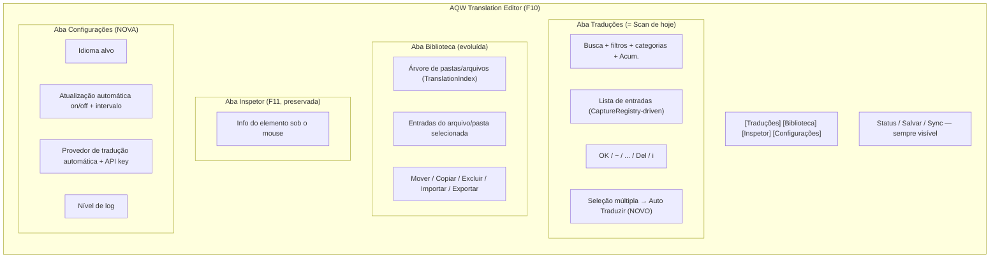
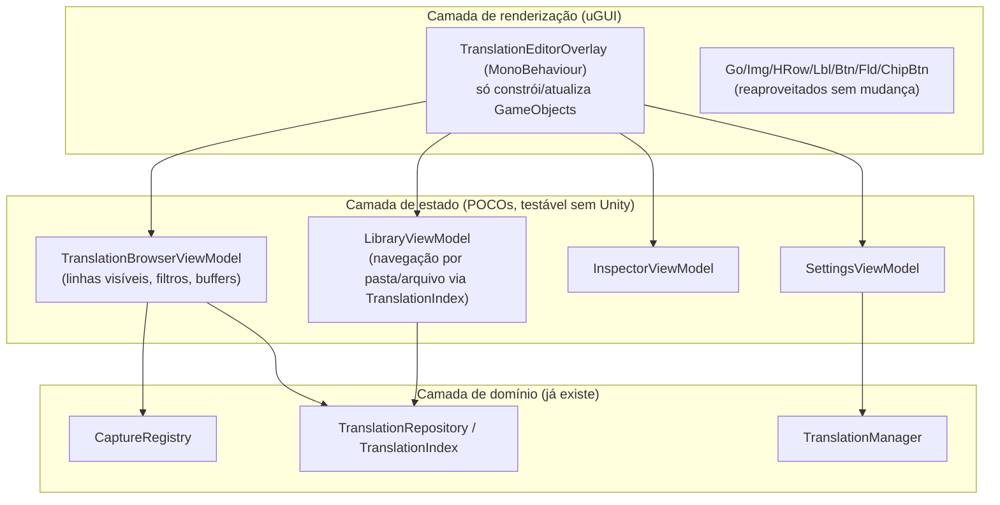

# GUI_ARCHITECTURE.md — GUI atual e evolução proposta

> Decisão de projeto: **não** alterar o visual
> antes de entender a arquitetura. Este documento primeiro descreve com
> precisão o que existe (complementando `CURRENT_SYSTEM.md` §8), depois
> propõe uma estrutura de camadas — a reforma **visual** (cores/tipografia/
> bordas parecidas com o AQW) fica para depois, como uma fase isolada e
> puramente cosmética (`ROADMAP.md` Fase 3), que não deve bloquear nem se
> misturar com a separação de responsabilidades proposta aqui.

## 1. O que existe hoje, mapeado nos termos do pedido do usuário

| Elemento previsto | Implementação real hoje |
|---|---|
| Texto original + campo de tradução + OK | `EntryRow` — `OrigLbl` (label) + `TransFld` (InputField) + botão "OK" → `SaveEntry` |
| Botão "~" (ignorar) | Botão "~" → `IgnoreEntry`, grava `dict[key]=key` (ver `TECHNICAL_DEBT.md` #10) |
| Botão "..." (texto grande) | Botão "..." → `OpenDetail`, abre `_detailPanel` com campos multi-linha e botões de placeholder |
| Botão "DEL" | Botão "Del" → remove do `ingame_edits.json` e do `CaptureRegistry` |
| Botão "i" (inspecionar elemento da linha) | Botão "i" → copia `SourcePath` para a barra inferior e para o clipboard |
| Filtro "sem tradução" | Toggle "[ ] Sem trad." → `ToggleUntrOnly` |
| Modo automático de leitura | Toggle "⟳ Auto" → `CollectVisibleTextSet` a cada frame enquanto ligado (ver `TECHNICAL_DEBT.md` #5) |
| Botão "Acum." | Toggle "⊕ Acum." → alterna `CaptureRegistry.Snapshot()` (tudo) vs. `RecentlySeen()` (janela de 10s) |
| Botão "Bib." | Toggle "Bib." → `ToggleLibrary`/`DoLibrary`, lê **só** `ingame_edits.json` (`TECHNICAL_DEBT.md` #11) |
| Botão "INSP" | Botão "Insp." (F11 também) → `ToggleInspect`/`DoInspect`/`UpdateInspect`, raycast sob o mouse |
| Botão "Refresh" | Botão "↺ Refresh" → invalida cache por componente + `DoScan` |
| Botão fechar | Botão "✕ Fechar" → `SetVisible(false)` |
| "Salvar todas modificadas" | Botão no rodapé → `SaveAll` |
| Filtros por categoria (Todas/HUDCanvas/ScreenShotMode/StateManager) | Chips dinâmicos (`RebuildCategoryChips`), populados a partir de `GetCategory()` — nomes de `GameObject` da hierarquia real, não uma taxonomia fixa |
| Indicação de onde o texto foi encontrado | `SourcePath` (caminho completo na hierarquia + tipo de componente), mostrado via botão "i" |

Tudo isso já existe e funciona. A "reformulação" não é reconstruir estas
funcionalidades — é reorganizar o código por trás delas e **completar**
lacunas reais (Biblioteca incompleta, Settings ausente, Auto Tradução
ausente).

## 2. Estrutura de abas proposta

Isso é uma reorganização das funcionalidades **já existentes** em abas,
mais duas adições (Biblioteca completa e Settings) — não uma reescrita
visual.

## 3. Separação de camadas proposta (resolve `TECHNICAL_DEBT.md` #12)

> **Status (2026-09-21)**: não implementado ainda, de propósito — na Fase 4
> real, priorizou-se a Biblioteca completa e a aba de Configurações (valor
> direto ao usuário) em vez desta separação estrutural (que não muda
> comportamento observável). Ver `docs/ROADMAP.md` Fase 4.

Princípio: **o `MonoBehaviour` nunca decide regra de negócio** — ele lê o
estado de um ViewModel e desenha; ações de UI (clique de botão) chamam um
método do ViewModel, que fala com `CaptureRegistry`/`TranslationRepository`/
`TranslationManager`. Isso não exige trocar a forma de desenhar a UI (o
uGUI manual criado por `Go/Img/Btn/...` continua sendo usado) — só move
"o que decide" para fora de "o que desenha", permitindo:

- Testar lógica de filtro/busca/ordenação sem depender do Unity rodando.
- Trocar o *renderer* no futuro (ex.: UI Toolkit, ou um reskin visual mais
  parecido com o AQW) sem reescrever a lógica de negócio.

Este refactor deve vir **depois** do storage em camadas (`ARCHITECTURE.md`),
para não precisar refatorar a GUI duas vezes.

## 4. Biblioteca — de "arquivo único" para "gerenciador de arquivos + editor"

> **Status (2026-09-21)**: parcialmente implementado. `DoLibrary()` agora
> lê o corpus inteiro via `TranslationIndex` e cada linha salva/ignora/
> remove no seu arquivo real de origem via `Repository/TranslationFileStore.cs`
> (não mais só `ingame_edits.json`). Categorias/chips agora refletem a
> pasta de topo do arquivo (ex.: "overrides", "ui", "maps"). **Ainda não
> implementado**: árvore de navegação por pasta (a lista continua flat,
> filtrável por chip/busca, não uma árvore expansível), e as operações de
> Mover/Copiar/Importar/Exportar descritas abaixo — ficaram para uma
> passada futura.

Resolve `TECHNICAL_DEBT.md` #11 e implementa a Biblioteca e o mover/copiar entre arquivos.

- Árvore à esquerda, construída a partir de `TranslationIndex.KeysByFile`
  (agrupado por pasta) — não escaneia disco a cada clique, usa o índice já
  carregado em memória.
- Selecionar uma pasta/arquivo mostra suas entradas na lista à direita, com
  os mesmos controles de edição do Scan (OK/~/.../Del) mais:
  - **Mover**: seleciona entradas → escolhe arquivo/pasta destino → confirma.
    Implementado como: remove a chave do dict de origem, insere no dict de
    destino, reserializa **os dois arquivos** atomicamente (temp+rename,
    ver `TECHNICAL_DEBT.md` #8), atualiza `TranslationIndex` em memória sem
    precisar recarregar tudo do disco.
  - **Copiar**: igual, sem remover da origem.
  - **Importar/Exportar**: exporta a seleção como um arquivo `$meta`+
    `translations` autocontido (útil para compartilhar um pedaço do corpus);
    importar faz merge respeitando a prioridade de camada (§3 de
    `ARCHITECTURE.md`) e avisa sobre conflitos em vez de sobrescrever
    silenciosamente.
- **Nunca** manipula arquivos fora de `translations/` — todas as operações
  de "arquivo" são, na prática, chaves dentro do índice controlado pelo mod,
  não um file-picker genérico do sistema operacional.

## 5. Auto Tradução — integração na GUI (detalhe completo em `AUTO_TRANSLATION.md`)

> **Status (2026-09-21)**: implementado como descrito abaixo — checkbox
> "Sel." por linha (persistido em `_selectedKeys`) + "Marcar visíveis"/
> "Desmarcar" como atalhos. Uma primeira versão havia simplificado para
> "opera sobre tudo que estiver visível no filtro atual, sem checkbox";
> revertido a pedido do usuário para dar controle explícito, linha a
> linha, de propósito — exatamente o design original desta seção.

Fluxo de UX proposto:

1. Usuário seleciona uma ou mais linhas (checkbox nova em cada `EntryRow`,
   ou "selecionar todas as visíveis" respeitando o filtro atual).
2. Clica em "Auto Traduzir" (novo botão na barra de ações em lote).
3. Abre um **painel de preview** (novo, semelhante ao `_detailPanel` já
   existente) mostrando, por linha: original | tradução manual atual (se
   houver) | proposta automática — com checkbox individual.
4. Duas ações explícitas no rodapé do preview: **"Preencher só vazios"**
   (aplica só onde não havia tradução) e **"Sobrescrever selecionadas"**
   (exige que o usuário tenha marcado a checkbox daquela linha
   explicitamente — nunca um "aplicar tudo" cego). Um terceiro botão
   "Cancelar" descarta tudo sem gravar nada.
5. Nenhuma tradução é escrita em disco antes da confirmação explícita nesta
   tela — o preview é sempre em memória.

## 6. Input blocking — correção necessária (`TECHNICAL_DEBT.md` #9)

A GUI reformulada continua usando `InputBlockerPatch` como está (o
mecanismo de gate por ordem de execução do `EventSystem` é correto e não
precisa mudar), mas `MouseOverOverlay()` passa a testar contra **todos** os
painéis raiz ativos do overlay (janela principal + detalhe + futuro preview
de auto-tradução + futuro modal de settings), não só `OverlayWindow`. Isso é
uma lista de retângulos, não um único — trivial de estender.

## 7. Reforma visual (explicitamente adiada)

Fase 3 do roadmap. Quando chegar a vez: manter a mesma árvore de
GameObjects/estrutura de abas definida aqui, e só trocar cores/fontes/
bordas/ícones (`Bg*`, `Col*`, fonte builtin → fonte customizada, bordas com
9-slice). Não é um pré-requisito para nenhuma outra fase — é puramente
estética e pode ser feita a qualquer momento depois que a separação de
camadas (§3) existir, sem risco de reintroduzir os bugs corrigidos nas
fases anteriores.
