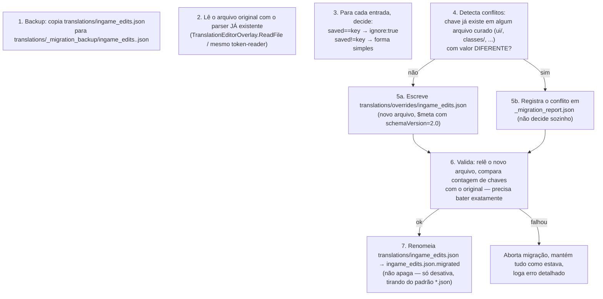

# MIGRATION.md — Migração de `ingame_edits.json`

> **Status de implementação (2026-09-21)**: a ferramenta descrita neste
> documento está implementada em `Migration/IngameEditsMigrator.cs`,
> seguindo exatamente os passos 1-7 abaixo. **Ela não é chamada por nenhum
> ponto do mod ainda** — não há botão na GUI (isso é trabalho da Fase 4) e
> nada a invoca automaticamente, de propósito: rodar uma migração de dados
> reais do usuário sem um pedido explícito violaria a regra do §6 abaixo.
> Além disso, com a correção de `TECHNICAL_DEBT.md` #3 (prioridade de
> camada) já em vigor, `translations/ingame_edits.json` na raiz **já**
> funciona como alias da camada `overrides/` mesmo sem rodar a migração —
> ou seja, migrar deixou de ser urgente para a correção funcionar; agora é
> puramente uma questão de organização (mover o arquivo para dentro de
> `overrides/` e adotar o schema novo por entrada).

## 1. Estado inicial real (confirmado no código, não suposto)

Hoje `translations/ingame_edits.json` é:
- Um dicionário achatado `{"original": "traduzido"}`, sem `$meta`.
- Escrito por `TranslationEditorOverlay` a cada ação de salvar/ignorar.
- Carregado pelo `TranslationRepository` exatamente como qualquer outro
  arquivo `.json` da pasta (sem tratamento especial — e por isso sujeito a
  perder silenciosamente para outro arquivo, `TECHNICAL_DEBT.md` #3).
- Entradas "ignoradas" estão gravadas como `"X":"X"`.

**Não existe hoje nenhum outro arquivo de tradução gerado pelo mod além
deste, `_capture/*.json` e `npc_names.json`** — ou seja, a migração real,
hoje, é pequena (o corpus existente é o que estiver em
`translations/ingame_edits.json` mais o que já foi promovido manualmente
para `ui/hud.json`).

## 2. Objetivo da migração

Mover o conteúdo de `translations/ingame_edits.json` para
`translations/overrides/ingame_edits.json` (nova convenção de camada de
prioridade máxima, `ARCHITECTURE.md` §3), convertendo:
- `"X":"X"` → `{"text":"X","ignore":true}` (forma estendida, ver
  `TRANSLATION_FORMAT.md` §4);
- `"X":"Y"` (Y≠X) → mantém forma simples `"X":"Y"` (nenhuma mudança
  necessária — a forma simples já é válida no novo schema).

Tudo isso **sem perder nenhuma entrada** e com possibilidade de reverter.

## 3. Passo a passo

Detalhes de cada passo:

1. **Backup primeiro, sempre.** Cópia simples do arquivo original antes de
   qualquer escrita — é a rede de segurança contra qualquer bug na própria
   ferramenta de migração.
2. Reaproveita o parser token-a-token que já existe (`ReadFile` do
   overlay), não escreve um parser novo.
3. Decisão determinística, sem heurística: `saved == key` é sempre
   "ignorado" hoje (é assim que o sistema atual representa isso), então a
   conversão é mecânica e sem ambiguidade.
4. **Detecção de conflito é obrigatória antes de escrever.** Se uma chave
   de `ingame_edits.json` já existe em `ui/hud.json` (por exemplo) com um
   valor **diferente**, a migração não decide sozinha qual vence — registra
   os dois valores e os dois arquivos de origem em
   `translations/_migration_report.json` para um humano resolver (tipicamente
   adicionando `context` a um dos dois, conforme `ADR-0001`). Isso é
   exatamente o comportamento desejado: detectar
   conflitos e nunca perder dados.
5. Escreve o novo arquivo com `$meta.schemaVersion: "2.0"`.
6. **Validação pós-escrita**: relê o arquivo recém-gravado e confere que o
   número de chaves bate com o original (contando as reportadas como
   conflito à parte). Só prossegue se bater.
7. **Nunca apaga o arquivo original.** Renomeia para
   `ingame_edits.json.migrated` — sai do padrão `*.json` que o
   `TranslationRepository` carrega (evita duplicar entradas), mas continua
   no disco, disponível para inspeção ou rollback manual indefinidamente.

## 4. Rollback

Como o passo 7 nunca apaga nada e o passo 1 sempre faz backup: reverter é
apagar `overrides/ingame_edits.json`, renomear
`ingame_edits.json.migrated` de volta para `ingame_edits.json`, e reiniciar
o jogo. Nenhuma ferramenta adicional é necessária além de operações de
arquivo simples — deliberado, para que reverter não dependa de o próprio
código de migração estar funcionando.

## 5. Compatibilidade durante a transição

Enquanto a migração não roda (ou em uma instalação que nunca a executou), o
`CollectionLoader` (`ARCHITECTURE.md` §1) continua aceitando
`translations/ingame_edits.json` na raiz como um alias de
`overrides/ingame_edits.json` — ou seja, instalações antigas continuam
funcionando sem qualquer ação manual do usuário; a migração é uma
**otimização de organização**, não um requisito para o mod funcionar.

## 6. Comunicação ao usuário

Ao detectar `translations/ingame_edits.json` na raiz (formato antigo) pela
primeira vez após a atualização do mod, a GUI mostra uma notificação não
bloqueante: "Uma migração de organização está disponível (Configurações →
Migrar traduções). Seus dados não serão apagados." — a migração nunca roda
automaticamente sem esse consentimento explícito, exatamente pelo peso da regra
de nunca perder dados e sempre informar o usuário.
