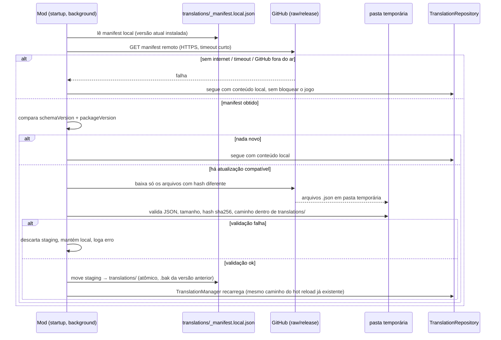

# REMOTE_UPDATES.md — Atualização automática via GitHub

> Ainda não implementado. Este documento define a
> arquitetura para que, quando implementado, não colida com nenhuma decisão
> já tomada (identidade, schema, storage em camadas).

## 1. Fluxo



## 2. Regras inegociáveis

1. **Nunca baixa nem executa código.** Só arquivos de dados
   (`*.json` dentro de `translations/`, mais o `_manifest.json`). Nenhum
   `.dll`, `.exe`, script, ou qualquer coisa que não seja JSON de tradução.
2. **Nunca bloqueia o início do jogo.** Toda a checagem/download roda em
   background (mesma disciplina de thread do resto do mod: trabalho de
   rede fora da main thread, resultado aplicado via
   `UnityMainThreadDispatcher`, reaproveitando o componente já existente).
   Se falhar por qualquer motivo, o mod segue com o conteúdo local — offline-
   first é o comportamento padrão, não um fallback de exceção.
3. **HTTPS obrigatório.** Sem exceção.
4. **Nunca sobrescreve edição local não sincronizada.** Ver §5.
5. **Uma checagem por sessão** (ou intervalo configurável, nunca a cada
   troca de cena/mapa) — resolve o "rate limit do GitHub" pela raiz, não com retry agressivo.

## 3. `_manifest.json` (proposta de formato)

```json
{
  "schemaVersion": "2.0",
  "packageVersion": "2026.09.20",
  "minModVersion": "2.2.0",
  "files": [
    {
      "path": "classes/Warrior.json",
      "sha256": "…",
      "sizeBytes": 4213,
      "updatedAt": "2026-09-18"
    },
    {
      "path": "maps/Pirates/rhuibarb.json",
      "sha256": "…",
      "sizeBytes": 2870,
      "updatedAt": "2026-09-19"
    }
  ]
}
```

Justificativa: `packageVersion` (comparação simples, monotônica — não
precisa ser semver completo), `minModVersion` (protege contra o manifesto
remoto exigir um recurso de schema que a DLL instalada ainda não entende —
nesse caso, o mod ignora o manifesto e segue local, nunca tenta "adivinhar"),
`sha256`+`sizeBytes` por arquivo (integridade e um limite de tamanho barato
de checar antes mesmo de calcular hash).

## 4. Segurança

- **Path traversal**: todo `path` do manifesto é validado para resolver
  estritamente dentro de `translations/` (rejeita `..`, caminho absoluto,
  letra de unidade, links simbólicos no destino).
- **Tamanho**: limite por arquivo e limite total do pacote, checados antes
  de gravar em disco (o manifesto já declara `sizeBytes`, então o download
  pode ser abortado cedo se divergir do prometido).
- **JSON malformado / payload gigante**: parse com limite de profundidade/
  tamanho antes de aceitar; falha de parse de um arquivo não invalida os
  demais já baixados e validados.
- **Downgrade**: um manifesto remoto com `packageVersion` menor que o local
  é ignorado (a menos que o usuário force explicitamente uma reinstalação/
  rollback pela GUI).
- **Adulteração do próprio repositório fonte**: mesmo sendo "nosso"
  GitHub, o manifesto é tratado como entrada não confiável (defesa em
  profundidade) — validação de schema, hash e caminho independe de quem
  publicou.

## 5. Conflito com alterações locais

Se `overrides/ingame_edits.json` (ou qualquer arquivo com edições locais
mais novas que `updatedAt` do manifesto) tiver sido modificado depois da
última sincronização conhecida, a atualização remota **não sobrescreve**
esse arquivo automaticamente — ele fica de fora do conjunto de arquivos
substituídos, e a GUI mostra um aviso não bloqueante ("há uma versão mais
nova de X no repositório, mas você tem alterações locais — revise
manualmente"). Arquivos sem edição local divergente são atualizados
normalmente.

## 6. Rollback

A versão anterior de cada arquivo substituído é mantida como `<arquivo>.bak`
por um ciclo de atualização. Um comando/botão "Reverter última atualização"
restaura a partir desses backups. Backups mais antigos que um ciclo são
descartados para não acumular indefinidamente.
